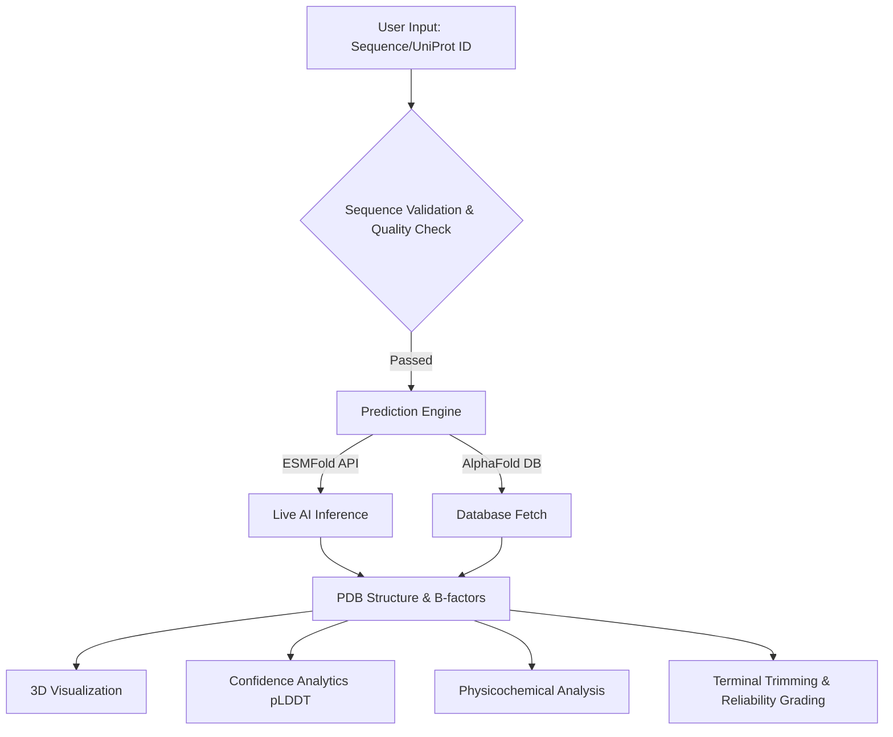

<div align="center">

# 🧬 ProteinForge

**AI-Powered Protein Structure Prediction & Analysis Dashboard**

[](https://www.python.org/downloads/)
[](https://streamlit.io)
[](https://esmatlas.com)
[](https://alphafold.ebi.ac.uk/)
[](https://opensource.org/licenses/MIT)

*A 100% dynamic, multi-model, hyperparameter-tunable bioinformatics pipeline built for modern structural biology.*

---

</div>

## ✨ Overview

**ProteinForge** is a state-of-the-art interactive web dashboard designed to bridge the gap between raw amino acid sequences and deep structural insights. Whether you're a computational biologist, a student, or a researcher, ProteinForge gives you instantaneous access to industry-leading AI models to predict, visualize, and analyze protein structures directly in your browser.

**Zero hard-coded data.** Every sequence, prediction, and analysis metric is fetched live and computed on-the-fly.

---

## 🚀 Key Features

* ⚡ **Lightning Fast AI Predictions:** Fold novel sequences in 30–60 seconds using the ESMFold API.
* 🧬 **Dual-Model Architecture:** Leverage both **ESMFold** and pre-computed structures from the **AlphaFold EBI Database**.
* 🎨 **Interactive 3D Visualization:** Explore your folded proteins in full 3D using `py3Dmol`. Color by confidence (pLDDT), secondary structure, or sequence spectrum.
* 🎛️ **Hyperparameter Tuning:** Take full control of the bias-variance tradeoff with 6 adjustable parameters (pLDDT threshold, hydrophobicity windows, disorder thresholds, and Gaussian smoothing).
* 📊 **Deep Physicochemical Analysis:** Compute molecular weight, isoelectric point, instability index, and amino acid composition instantly.
* 🔬 **Reliability & Quality Assessment:** Automatically assess sequence complexity, intrinsic disorder propensity, and trim low-confidence terminal regions.
* 📦 **Batch Processing:** Analyze multi-FASTA files for high-throughput structural bioinformatics.
* 🔄 **Structural Comparison (RMSD):** Upload reference PDB files to calculate C-alpha RMSD against AI predictions.

---

## 🏗️ Architecture & Data Flow

ProteinForge is built on a clean, single-page application (SPA) architecture powered by Streamlit.



---

## 🛠️ Technology Stack

| Domain | Technologies Used |
| :--- | :--- |
| **Frontend UI** | Streamlit, HTML/CSS |
| **3D Molecular Viewer** | py3Dmol, stmol |
| **Data Processing & Math** | Pandas, NumPy, Biopython |
| **Data Visualization** | Plotly Graph Objects |
| **External APIs** | UniProt REST, ESM Metagenomic Atlas, AlphaFold DB |
| **Datasets** | Hugging Face (`datasets` library) |

---

## 💻 Installation & Usage

### Prerequisites
Make sure you have **Python 3.9+** installed on your machine.

### 1. Clone the repository
```bash
git clone https://github.com/jackstealer/ProteinForge.git
cd ProteinForge
```

### 2. Install dependencies
It is highly recommended to use a virtual environment.
```bash
pip install -r requirements.txt
```

### 3. Run the application
```bash
streamlit run app.py
```
*The app will automatically open in your default web browser at `http://localhost:8501`.*

### 4. Run the Test Suite (Optional)
Ensure everything is working correctly by running the 46-test validation suite:
```bash
python run_checks.py
```

---

## 🎯 How to Use ProteinForge

1. **Navigate to the Predict tab** in the sidebar.
2. **Input your protein:** Paste a raw sequence, upload a `.fasta` file, type a UniProt ID, or grab a random one from our Hugging Face dataset integration.
3. **Select your engine:** Choose between ESMFold for novel sequences or AlphaFold DB for known proteins.
4. **Tune Hyperparameters:** Open the tuning panel to adjust the pLDDT confidence threshold, smoothing factor, and Kyte-Doolittle window size.
5. **Explore:** Click through the results tabs to view the 3D structure, confidence graphs, reliability grades, and download your `.pdb` files!

---

## 📖 Scientific References

* **ESMFold:** Lin, Z., et al. (2023). *Evolutionary-scale prediction of atomic-level protein structure with a language model.* Science.
* **AlphaFold2:** Jumper, J., et al. (2021). *Highly accurate protein structure prediction with AlphaFold.* Nature.
* **Hydrophobicity:** Kyte, J., & Doolittle, R.F. (1982). *A simple method for displaying the hydropathic character of a protein.* J Mol Biol.

---

<div align="center">
  <p>Built with ❤️ for Structural Biology & Open Science.</p>
</div>
